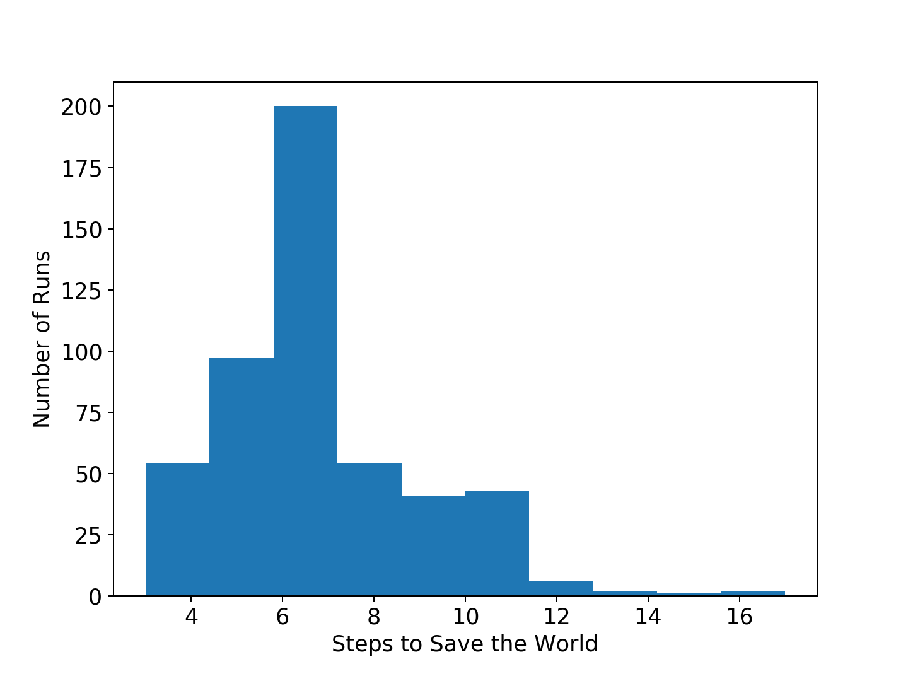

# [Assignment #2: Save the World!](http://publish.uwo.ca/~rmoir3/asn2.html)

Starting point: [A2.py](A2.py)
Marking scheme: [A2_MarkingScheme.txt](A2_MarkingScheme.txt)
Code check script: [A2_check.py](A2_check.py)

Our first assignment dealt with _data analysis_. We’re going to do a lot more of that, but it’s important to get some exposure to another very important area of modern science: computational _simulation_. If you can simulate something accurately enough, the simulation might have real advantages over actually doing an experiment.

For example, if you simulate a protein folding – and get it right – you can actually stop, rewind, replay, and even do matrix-style ‘bullet time’ pans around the protein, as it folds. This allows you to watch interactions on a level of detail that is completely impossible experimentally. ([Check out Vijay Pande talking about Folding@Home](https://www.youtube.com/watch?v=Pjt1Q2ZZVjA))

Simulations also let you do things you simply _can’t_ do in reality. Suppose you’re a social geographer who wants to study the social impact of different types of natural disasters on a small fishing village. You’d have difficulty getting ethics approval to flood an actual village, or bury it in lava, and then collect data. If, however, your ‘villagers’ exist only in a simulation…there are no constraints on what you can do.

For this assignment, you will be doing a simple __military simulation__. Imagine it is discovered that secretly the Nazis won World War II, and control the world through a network of control of cities and institutions. Then suppose you are part of a force mobilizing to take back control of these cities using highly ethical, e.g., constitutional and non-violent, means, but you need to plan your operation carefully to maximize your likelihood of success. This is where the simulation comes in.

Your task, then, is to write code to simulate the retaking of the world by regaining control of a network of North American cities. Once your simulation is working, you’ll write a bit more code to analyze the data produced by your simulation to determine exciting things like how long it will take to save the world.

## How to approach the assignment
Once again, you are asked to extend existing code. Extending existing code can actually be more challenging than writing code from scratch but, as a scientist or other researcher using programming as tool, this is what 90% of your real-world programming will be.

For the first assignment, you just had to get the code working. For this assignment, it also has to *look pretty*… by which I mean:

- There should be comments in the code Functions should have headers

- explaining what they do in plain English

If you’re not sure how those things should look, use the existing code as a guideline.

Speaking of the existing code… The first thing you should do is [download the existing code](A2.py) and take a quick look at it. Just skim it. Some of the provided functions call on rather complex Python libraries and may look very confusing to you. That’s totally normal. What you really want to look at are the descriptions in the function headers. Right after the `def` line, you’ll see some text wrapped between triple quotes. Read this carefully. This tells you everything you need to know about how to use that function—without you having to understand how all the details of the function work. That is: you can work _one level of abstraction higher_ than the function.

So…look at that code. Seriously. Do it. Familiarizing yourself with what’s going on in the file is the best possible preparation for doing the assignment.

## Data structures you need to know about
Every city in our simulation is going to be represented by a list `[name,regained,neighbours]`

`name` is a string with the name of the city.

`regained` is a `bool`: `True` if the city has been regained; `False` if it lost to the enemy.

`neighbours` is a _list_ (so we’ve nested a list inside a list!) containing the city numbers of the cities that are directly connected by the enemy control network.

Our _world_ is made up of multiple cities. How can we store all these cities? In another list, of course! So the world is a list of lists:

```python3
world = [city1, city2, city3, ...]
```

## Getting started
To make your life easier, I’ve provided a function called `set_up_cities` that will generate some cities, with a randomly generated enemy control network between them, for you. If you call this function, it returns a _list_ of cities, detailing the state of your simulated world. You’d use the function like this:

```python3
>>> my_world = set_up_cities()
```

> ### Note:
> If you don’t want to stick to the default names for the cities, note that there is an optional `name` parameter for this function. This lets you pass in your own list of city names if you want to (this also allows you to create a world with fewer, or more, cities). For the last part of the assignment, however, you will need to use a particular list of city names accessed by the function `get_read_world()` (not actually the real world).

You should probably load up `A2.py` in your interpreter right now and play around with the `set_up_cities()` function just to get a feel for it. Have a look at the lists it generates and make sure you understand their structure.

## Coding, Part I
Write the following functions:

1. `regain(world, cityno)`. This function takes your world (list of cities) as the parameter world and an integer `cityno` specifying which city in the list has been regained from the enemy. So, to have city 2 be regained, you might use the function like this:

```python3
>>> my_world = set_up_cities()
>>> regain(my_world, 2)
```

How do you “regain” a city? Well you have to set the “regained flag” for that city to `True`. In other words, set `world[cityno][1]` to `True`. The `[cityno]` indexes a particular city in the list of cities (`world`) and the following `[1]` indexes the second element (remember, the first element is `[0]`!) in the list that makes up that city description.

2. `lose(world, cityno)`. The opposite of `regain`. Clear the regained flag for the city.

3. `sim_step(world, p_regain, p_lose)`. This is the most important function in the assignment. This function will execute a single time step of your simulation. Depending on how fast you want to think of the operation continuing, that time step could be a day, an hour, a week, whatever. If you were modelling a real operation, you’d determine the size of your time step from some empirical data. Here is some English-language “pseudocode” for function. You’ll have to turn it into Python:

```
for each city in world:

  if the city is lost and numpy.random.rand() < p_regain:
    regain the city!

  if the city is lost and numpy.random.rand() < p_lose
    randomly choose a *different* city connected along the enemy network (neighbouring cities)
     (hint: use numpy.random.randint() and get_cityno() or is_connected())
    lose the city!

Make sure that city 0 is *always* regained (our stronghold). It can't be lost.
```

So, what’s going on there? Well, `numpy.random.rand()` isn’t so much pseudocode as actual Python code. It generates a random number between 0 and 1 every time you call it. Think of it like rolling dice. The parameter `p_regain` is the _probability of regaining control of the city_, and the parameter `p_lose` is the _probability of losing a city to the enemy_. For starters use values of 0.5 for `p_regain` and 0.0 for `p_lose` while you’re getting things working. We’ll play with these later.

Once you’ve done this, you now have a working Operation Save the World simulator! So spend some time testing it in the Python interpreter. Something like this:

```python3
>>> my_world = set_up_cities()
>>> regain(my_world,0)
>>> draw_world(my_world)
>>> sim_step(my_world, 0.5, 0)
>>> draw_world(my_world)
>>> sim_step(my_world,0.5, 0)
>>> draw_world(my_world)
>>> sim_step(my_world, 0.5, 0)
```

The function `draw_world()` is one that’s already written for you. It graphically displays the state of your world. Cities are green circles if they are regained and red circles if they’re lost. If the enemy network connects two cities, there is a line drawn between the cities. If you update this display after each `sim_step` you can watch the operation happen! It’ll look something like this:


If you get tired of typing `sim_step` for every single step…you could always automate the process with a function that calls `sim_step` in a loop!

Once you’re convinced that your operation simulator works, move on to Part 2. If your simulator isn’t working yet __GET IT WORKING BEFORE PROCEEDING__.

Working now? Good. Make sure it’s _commented_ and has _function headers_.

## Coding, Part II

As fun as it is to watch our operation being carried out, we’d like to gather some hard data on the results of our simulations. In particular, the leaders of the resistance force want to know how long it will take to regain all the cities in the world.

Write the following functions:

4. `is_world_saved(world)`. Loop through all the cities in the list world. If all of them are regained, return `True` (victory!). Otherwise, return `False`.

5. `time_to_save_world(world, p_regain, p_lose)`. Run a simulation, for specific values of `p_regain` and `p_lose` and count how long it takes to save the world (which you can now test with `is_world_saved`, of course). Some pseudocode for you:

```
reset the world (all cities are lost except city 0)

initialize a "regained-world" counter

     while the world hasn't been regained:
        sim_step(world, p_regain, p_lose)
        increment the regained-world counter

    return the value of the regained-world counter
```

Now, after we have set up a world using

```
>>> my_world = set_up_cities()
```

to run an experiment to see how long it takes to save the world, all we have to do is:

```
>>> time_to_save_world(my_world,0.5,0)
```

We’ve got a problem though. Our simulation is _stochastic_: we are making use of random numbers to determine outcomes. We can’t just run our simulation once and count the number of steps until every city is regained. If you don’t believe me, just try it. Call the `time_to_save_world` function a few times. Do you get different values? Wildly different? Yeah.

We have to run our simulation _many times_ to fairly sample the space of possible outcomes. In essence, simulation is a lot like experimentation; we have to do multiple experiments to get some statistical confidence in our answer.

So, write another function:

6. `save_world_many_times(world, n, p_regain, p_lose)`. This function should initialize a 
_list_ of results and then use a loop to run `time_to_save_world(world, p_regain, p_lose)` a total of `n` times. After each simulation, add the time it took to save the world to the list. Return a list of `n` “times to save the world”.

All set? Make sure it’s _commented_ and has _function headers_. Then go on to the analysis.

## Analysis

Now we get to play with our simulator to answer important strategic questions about our operations. Play with the values of `p_regain` and `p_lose`. How does changing those values change the “time to save the world”? Answer the following specific questions, and provide evidence from your simulation to support your answer:

1. Fix the value of `p_lose` at zero. How does varying the value of `p_regain` affect the time to save the world?

2. Fix the value of `p_lose` at 0.1. How does varying the value of `p_regain` affect the time to save the world?

3. Fix the value of `p_regain` at 0.5. How does varying the value of `p_lose` affect the time to save the world?

4. Pick three pairs of `p_regain` and `p_lose` values that you think are interesting. Run 500 simulations for them (e.g, `save_world_many_times(world, 500, your_value, your_value)`. What does the _distribution_ of times to save the world look like? If you’ve taken a stats course: is it normal (Gaussian)? (If you haven’t taken stats, just ignore that question).

> ### Big Hint
> If you ran this command in the Python interpreter: `ttl = save_world_many_times(world, 500, your_value, your_value)`, you can get a really pretty _histogram_ (which tells you about the distribution) of the values in `ttl` with the matplotlib function `hist`.

Here’s a sample histogram of times to the end of the world for `p_regain = 0.5` and `p_lose = 0.0`:



 If you’re running ipython from the Mac/Linux command line, you may have to run it like this to get the graphics to work:

```shell
$ ipython --pylab
```

5. Suppose that you have received some intel on the enemy network and you want to use this to plan your operation. This city network is returned by the `get_real_world()` function (already written for you). Also suppose that the time step is counted in months. If the value of `p_lose` is 0.9 (90% probably of losing a city in a given month), then approximately what probability of regaining a city (value of `p_regain`) must we guarantee to save the world within 2 years? __Justify your answer__ (_pictures may help_)

__Note Well__: CS 2120 and DH 2220 students should get the value to _1 significant figure_ (one correct digit after the decimal point). CS 9642 students should get the value to _3 significant figures_ (this will require more runs).

> ### Hint
> You will need to do a large number of runs to get an accurate answer (around 10 000 should do for 1 sigfig). But this can take some time. So, you can start with a small number of runs to get a good rough guess, and then increase the number of runs to get more precision.

## What to submit
- Copy and paste the contents of your version of A2.py into the text box supplied on OWL.
    - Make sure your __NAME__ and __STUDENT NUMBER__ appear in a comment at the top of the program (the script `A2_check.py` will also prompt you to do this).
    - Make sure it’s _commented_ and has _function headers_!!
    - List __anyone you worked with__ in the comments, too.
- A text file answering the 5 analysis questions and providing _data_ to back up your answers.
- (Optional) A pdf file containing any images (histograms) you might want to include. Please include a brief description of each image inside the pdf.

## Some hints

- Work on one function at a time.

- Get each function working perfectly before you go on to the next one.

- _Test_ each function as you write it.

    - This is a really nice thing about Python: you can call your function right from the interpreter prompt and see what result gets returned. Does it look reasonable? Good! Check it!
